Correct Specification: Latent Factor
================
Sara Stoudt
12/2/2019

``` r
require(ggplot2)
```

    ## Loading required package: ggplot2

    ## Warning: package 'ggplot2' was built under R version 3.5.2

``` r
require(dplyr)
```

    ## Loading required package: dplyr

    ## Warning: package 'dplyr' was built under R version 3.5.2

    ## 
    ## Attaching package: 'dplyr'

    ## The following objects are masked from 'package:stats':
    ## 
    ##     filter, lag

    ## The following objects are masked from 'package:base':
    ## 
    ##     intersect, setdiff, setequal, union

``` r
require(tidyr)
```

    ## Loading required package: tidyr

``` r
require(parallel)
```

    ## Loading required package: parallel

``` r
require(boral)
```

    ## Loading required package: boral

    ## Loading required package: coda

    ## Warning: package 'coda' was built under R version 3.5.2

    ## If you recently updated boral, please check news(package = "boral") for the updates in the latest version

``` r
setwd("~/Desktop/communityDimensions/R/simulation_setup/test_data")
source("../metrics.R")


load(file="testMats_correctlySpecified.RData")

numSpecies <- c(5, 10, 15, 20, 25, 30)
numFactors <- c(1, 2, 5, 10, 20)

scenarios = expand.grid(numSpecies, numFactors)
```

``` r
kl <- c()
frob <- c()
setwd("~/Desktop/communityDimensions/R/simulation_setup/test_data")

for(i in 1:18){
  

load(file=paste0("correctlySpecifiedResults/r",i,".RData"))


estimatedMat = fit.boral$lv.coefs.mean[,-1]%*%t(fit.boral$lv.coefs.mean[,-1])

## put lambda lambda together


## kl divergence

kl <- c(kl,klDivergence(trueMats[[i]]+diag(nrow(trueMats[[i]])), estimatedMat+diag(nrow(trueMats[[i]]))))

## frobenius

frob <- c(frob,frobeniusNorm(estimatedMat, trueMats[[i]]))

}

results = cbind.data.frame(scenarios[1:18,], kl, frob)
names(results)[1:2]= c("numSpecies", "numFactors")
```

``` r
### misspecified ####
setwd("~/Desktop/communityDimensions/R/simulation_setup/test_data")

kl <- c()
frob <- c()
for(i in 19:nrow(scenarios)){
  
  
  load(file=paste0("correctlySpecifiedResults/r",i,".RData"))
  
  
  estimatedMat = fit.boral$lv.coefs.mean[,-1]%*%t(fit.boral$lv.coefs.mean[,-1])
  
  ## put lambda lambda together
  
  
  ## kl divergence
  
  kl <- c(kl,klDivergence(trueMats[[i]]+diag(nrow(trueMats[[i]])), estimatedMat+diag(nrow(trueMats[[i]]))))
  
  ## frobenius
  
  frob <- c(frob,frobeniusNorm(estimatedMat, trueMats[[i]]))
  
}

results2 = cbind.data.frame(scenarios[19:nrow(scenarios),], kl, frob)
names(results2)[1:2]= c("numSpecies", "numFactors")
```

30 sites

``` r
## correctly specified
ggplot(results, aes(numSpecies, kl,col=as.factor(numFactors)))+geom_point()+theme_minimal()+ylab("kl divergence")
```

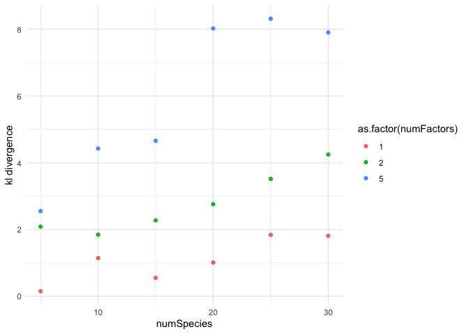<!-- -->

``` r
ggplot(results, aes(numSpecies, frob,col=as.factor(numFactors)))+geom_point()+theme_minimal()+ylab("sqrt(sum(abs(obs-est)))")
```

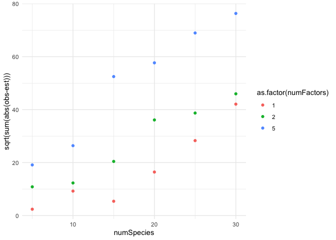<!-- -->

``` r
## fit with 5 latent factors
ggplot(results2, aes(numSpecies, kl,col=as.factor(numFactors)))+geom_point()+theme_minimal()+ylab("kl divergence")
```

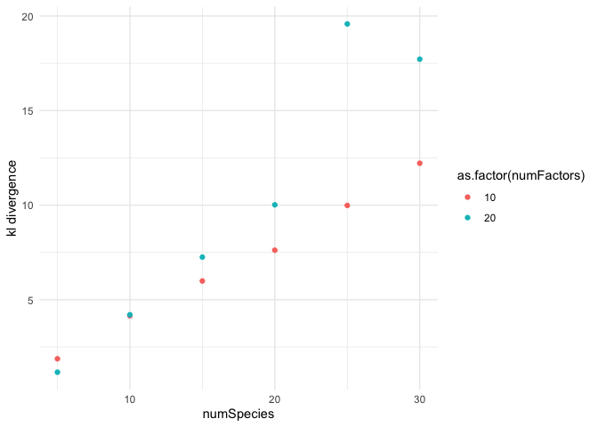<!-- -->

``` r
ggplot(results2, aes(numSpecies, frob,col=as.factor(numFactors)))+geom_point()+theme_minimal()+ylab("sqrt(sum(abs(obs-est)")
```

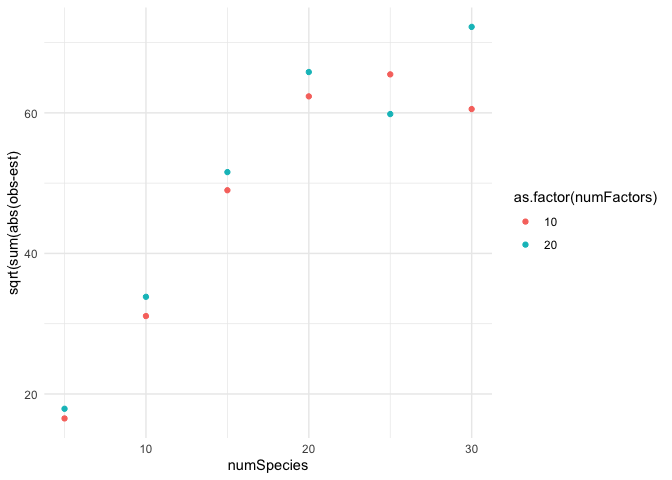<!-- -->

``` r
makeJaccardECDF = function(data, title){
truth1 <- data$yP[nrow(data$yP), ]
parsetemp <- unlist(lapply(strsplit(colnames(data$yStarP), "\\["), function(x) {
  x[2]
}))

siteNum1 <- unlist(lapply(strsplit(parsetemp, ","), function(x) {
  x[1]
}))
speciesNum <- unlist(lapply(strsplit(parsetemp, ","), function(x) {
  x[2]
}))
speciesNum1 <- sub("\\]", "", speciesNum)


test <- cbind.data.frame(t(data$yStarP), speciesNum=speciesNum1, siteNum=siteNum1, truth=truth1)

test2 <- gather(test, -speciesNum, -siteNum, -truth, key = "iteration", value = "val")


jaccardCollapseOverSites <- function(s1, s2) {
  sub1 <- subset(trueDist, speciesNum == s1)
  sub2 <- subset(trueDist, speciesNum == s2)
  num <- which(sub1$truth == 1 & sub2$truth == 1)
  aa <- which(sub1$truth == 1)
  bb <- which(sub2$truth == 1)
  
  jaccard <- length(num) / (length(aa) + length(bb) - length(num))
  coOccur <- length(num)
  return(list(jaccard = jaccard, coOccur = coOccur))
}

trueDist <- subset(test2, iteration == 1)
trueDist$speciesNum <- as.numeric(as.character(trueDist$speciesNum))

pairs <- t(combn(unique(trueDist$speciesNum), 2))

trueJ <- mapply(jaccardCollapseOverSites, pairs[, 1], pairs[, 2], SIMPLIFY = F)

trueJJ <- lapply(trueJ, function(x) {
  x$jaccard
})
trueCO <- lapply(trueJ, function(x) {
  x$coOccur
})


jaccardCollapseOverSitesIteration <- function(s1, s2, Iteration) {
  sub1 <- subset(trueDist, speciesNum == s1 & iteration == Iteration)
  sub2 <- subset(trueDist, speciesNum == s2 & iteration == Iteration)
  num <- which(sub1$val == 1 & sub2$val == 1)
  aa <- which(sub1$val == 1)
  bb <- which(sub2$val == 1)
  jaccard <- length(num) / (length(aa) + length(bb) - length(num))
  coOccur <- length(num)
  return(list(jaccard = jaccard, coOccur = coOccur))
}


p1 <- rep(pairs[, 1], times = 100)
p2 <- rep(pairs[, 2], times = 100)

itN <- rep(901:1000, each = nrow(pairs))

test2$iteration <- as.numeric(as.character(test2$iteration))
trueDist <- subset(test2, iteration > 900)


#ptm <- proc.time()
itJ <- mcmapply(jaccardCollapseOverSitesIteration, p1, p2, itN, SIMPLIFY = F, mc.cores = 4)
#proc.time() - ptm ## 


itN <- rep(901:1000, each = nrow(pairs))
itJJ <- lapply(itJ, function(x) {
  x$jaccard
})
itCO <- lapply(itJ, function(x) {
  x$coOccur
})


byIterationJ <- cbind.data.frame(jaccard = unlist(itJJ), coOccur = unlist(itCO), iteration = itN)

g1=ggplot(byIterationJ,aes(x=jaccard,group=iteration))+stat_ecdf(geom="line",alpha=0.2,col="red")+stat_ecdf(data=data.frame(true = unlist(trueJJ)),aes(x=true, group=1),col="blue",geom="line")+theme_minimal(base_size = 18)+ylab("ECDF") +xlab("jaccard - similarity between species")+ggtitle(title)

return(g1)


}
```

``` r
numSpecies <- c(5, 10, 15, 20, 25, 30)
numFactors <- c(1, 2, 5, 10, 20)

scenarios = expand.grid(numSpecies=numSpecies, numFactors=numFactors)
```

``` r
setwd("~/Desktop/communityDimensions/R/simulation_setup/test_data/correctlySpecifiedResults")
load("r1.RData")
makeJaccardECDF(fit.boral, paste("species: ", scenarios[1,1]," numFactors: ", scenarios[1,2]))
```

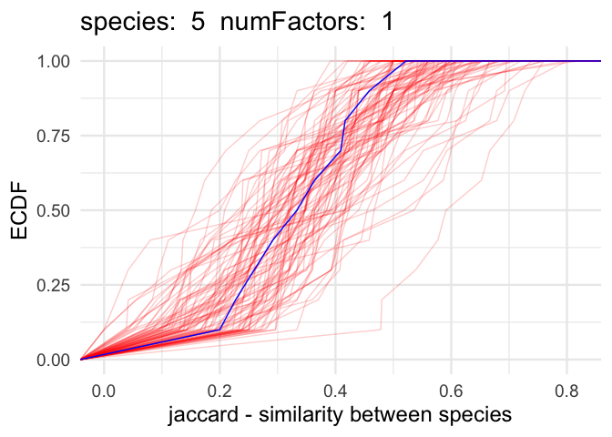<!-- -->

``` r
setwd("~/Desktop/communityDimensions/R/simulation_setup/test_data/correctlySpecifiedResults")
load("r2.RData")
makeJaccardECDF(fit.boral, paste("species: ", scenarios[2,1]," numFactors: ", scenarios[2,2]))
```

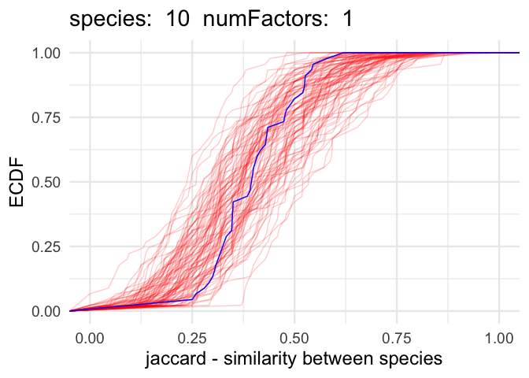<!-- -->

``` r
setwd("~/Desktop/communityDimensions/R/simulation_setup/test_data/correctlySpecifiedResults")
load("r3.RData")
makeJaccardECDF(fit.boral, paste("species: ", scenarios[3,1]," numFactors: ", scenarios[3,2]))
```

<!-- -->

``` r
setwd("~/Desktop/communityDimensions/R/simulation_setup/test_data/correctlySpecifiedResults")
load("r4.RData")
makeJaccardECDF(fit.boral, paste("species: ", scenarios[4,1]," numFactors: ", scenarios[4,2]))
```

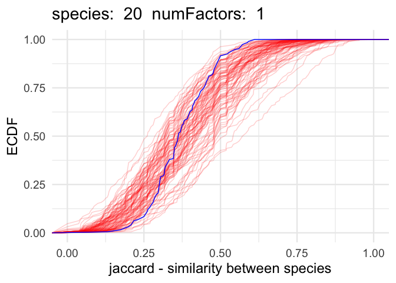<!-- -->

``` r
setwd("~/Desktop/communityDimensions/R/simulation_setup/test_data/correctlySpecifiedResults")
load("r5.RData")
makeJaccardECDF(fit.boral, paste("species: ", scenarios[5,1]," numFactors: ", scenarios[5,2]))
```

<!-- -->

``` r
setwd("~/Desktop/communityDimensions/R/simulation_setup/test_data/correctlySpecifiedResults")
load("r6.RData")
makeJaccardECDF(fit.boral, paste("species: ", scenarios[6,1]," numFactors: ", scenarios[6,2]))
```

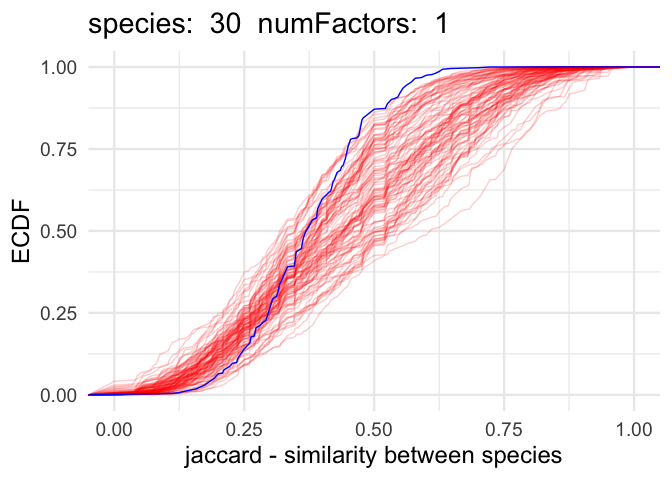<!-- -->

``` r
setwd("~/Desktop/communityDimensions/R/simulation_setup/test_data/correctlySpecifiedResults")
load("r7.RData")
makeJaccardECDF(fit.boral, paste("species: ", scenarios[7,1]," numFactors: ", scenarios[7,2]))
```

<!-- -->

``` r
setwd("~/Desktop/communityDimensions/R/simulation_setup/test_data/correctlySpecifiedResults")
load("r8.RData")
makeJaccardECDF(fit.boral, paste("species: ", scenarios[8,1]," numFactors: ", scenarios[8,2]))
```

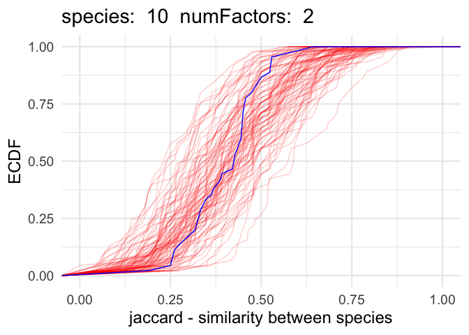<!-- -->

``` r
setwd("~/Desktop/communityDimensions/R/simulation_setup/test_data/correctlySpecifiedResults")
load("r9.RData")
makeJaccardECDF(fit.boral, paste("species: ", scenarios[9,1]," numFactors: ", scenarios[9,2]))
```

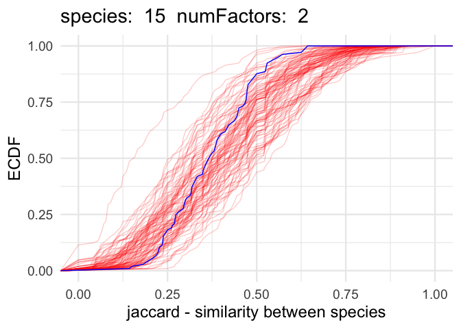<!-- -->

``` r
setwd("~/Desktop/communityDimensions/R/simulation_setup/test_data/correctlySpecifiedResults")
load("r10.RData")
makeJaccardECDF(fit.boral, paste("species: ", scenarios[10,1]," numFactors: ", scenarios[10,2]))
```

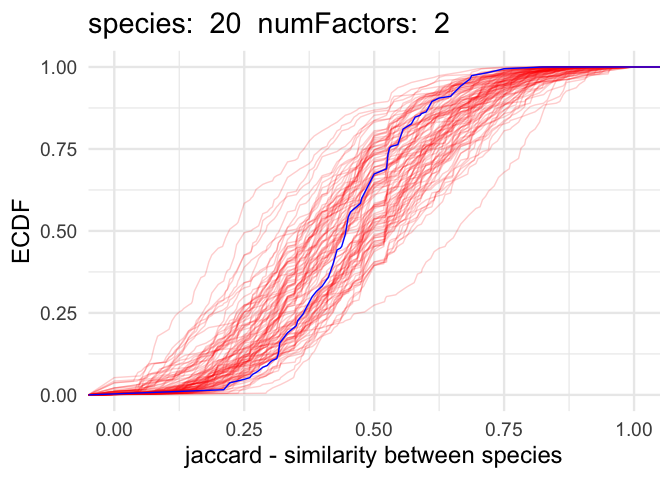<!-- -->

``` r
setwd("~/Desktop/communityDimensions/R/simulation_setup/test_data/correctlySpecifiedResults")
load("r11.RData")
makeJaccardECDF(fit.boral, paste("species: ", scenarios[11,1]," numFactors: ", scenarios[11,2]))
```

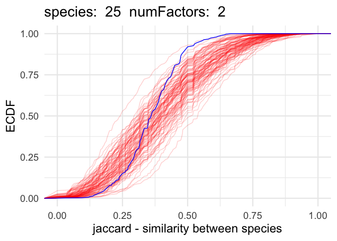<!-- -->

``` r
setwd("~/Desktop/communityDimensions/R/simulation_setup/test_data/correctlySpecifiedResults")
load("r12.RData")
makeJaccardECDF(fit.boral, paste("species: ", scenarios[12,1]," numFactors: ", scenarios[12,2]))
```

<!-- -->

``` r
setwd("~/Desktop/communityDimensions/R/simulation_setup/test_data/correctlySpecifiedResults")
load("r13.RData")
makeJaccardECDF(fit.boral, paste("species: ", scenarios[13,1]," numFactors: ", scenarios[13,2]))
```

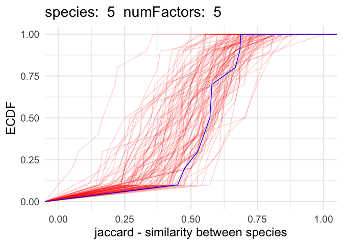<!-- -->

``` r
setwd("~/Desktop/communityDimensions/R/simulation_setup/test_data/correctlySpecifiedResults")
load("r14.RData")
makeJaccardECDF(fit.boral, paste("species: ", scenarios[14,1]," numFactors: ", scenarios[14,2]))
```

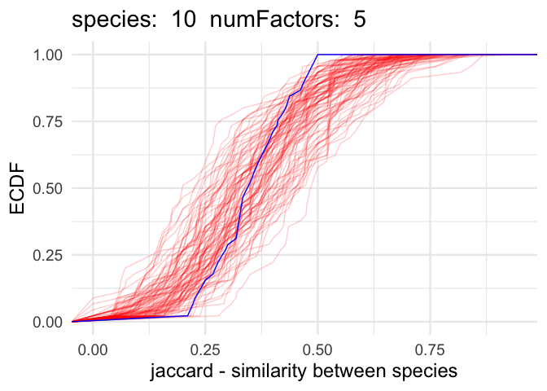<!-- -->

``` r
setwd("~/Desktop/communityDimensions/R/simulation_setup/test_data/correctlySpecifiedResults")
load("r15.RData")
makeJaccardECDF(fit.boral, paste("species: ", scenarios[15,1]," numFactors: ", scenarios[15,2]))
```

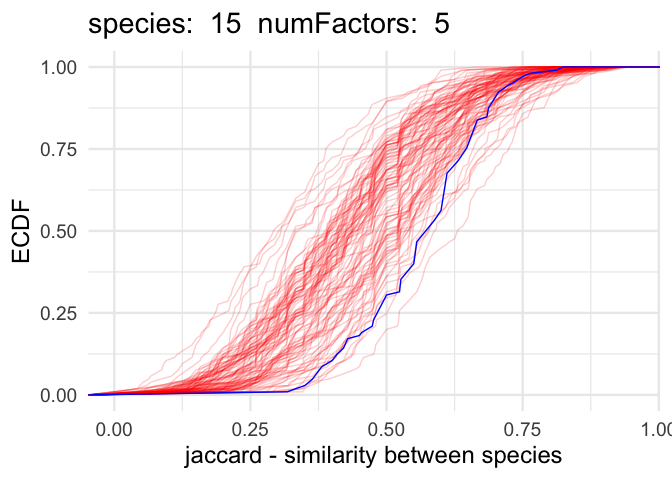<!-- -->

``` r
setwd("~/Desktop/communityDimensions/R/simulation_setup/test_data/correctlySpecifiedResults")
load("r16.RData")
makeJaccardECDF(fit.boral, paste("species: ", scenarios[16,1]," numFactors: ", scenarios[16,2]))
```

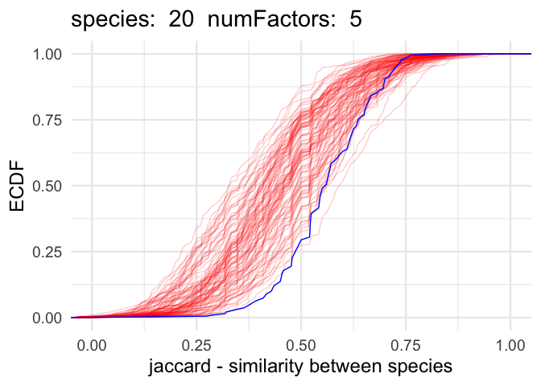<!-- -->

``` r
setwd("~/Desktop/communityDimensions/R/simulation_setup/test_data/correctlySpecifiedResults")
load("r17.RData")
makeJaccardECDF(fit.boral, paste("species: ", scenarios[17,1]," numFactors: ", scenarios[17,2]))
```

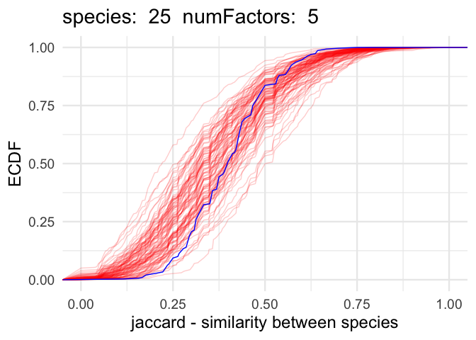<!-- -->

``` r
setwd("~/Desktop/communityDimensions/R/simulation_setup/test_data/correctlySpecifiedResults")
load("r18.RData")
makeJaccardECDF(fit.boral, paste("species: ", scenarios[18,1]," numFactors: ", scenarios[18,2]))
```

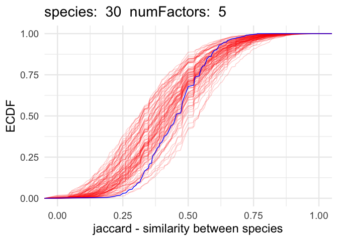<!-- -->

``` r
setwd("~/Desktop/communityDimensions/R/simulation_setup/test_data/correctlySpecifiedResults")
load("r19.RData")
makeJaccardECDF(fit.boral, paste("species: ", scenarios[19,1]," numFactors: ", scenarios[19,2]))
```

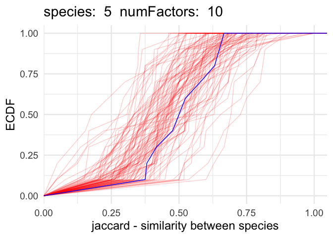<!-- -->

``` r
setwd("~/Desktop/communityDimensions/R/simulation_setup/test_data/correctlySpecifiedResults")
load("r20.RData")
makeJaccardECDF(fit.boral, paste("species: ", scenarios[20,1]," numFactors: ", scenarios[20,2]))
```

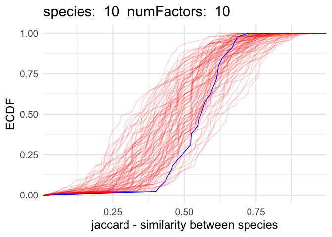<!-- -->

``` r
setwd("~/Desktop/communityDimensions/R/simulation_setup/test_data/correctlySpecifiedResults")
load("r21.RData")
makeJaccardECDF(fit.boral, paste("species: ", scenarios[21,1]," numFactors: ", scenarios[21,2]))
```

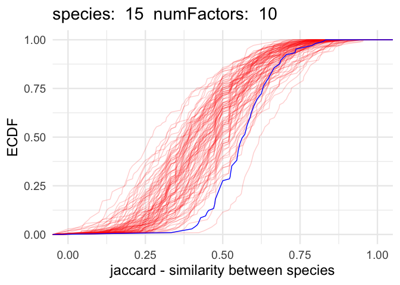<!-- -->

``` r
setwd("~/Desktop/communityDimensions/R/simulation_setup/test_data/correctlySpecifiedResults")
load("r22.RData")
makeJaccardECDF(fit.boral, paste("species: ", scenarios[22,1]," numFactors: ", scenarios[22,2]))
```

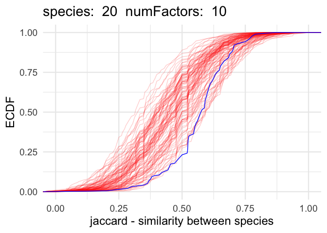<!-- -->

``` r
setwd("~/Desktop/communityDimensions/R/simulation_setup/test_data/correctlySpecifiedResults")
load("r23.RData")
makeJaccardECDF(fit.boral, paste("species: ", scenarios[23,1]," numFactors: ", scenarios[23,2]))
```

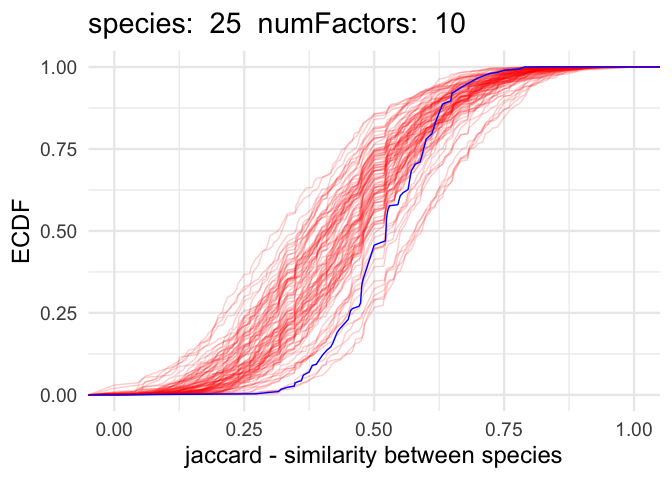<!-- -->

``` r
setwd("~/Desktop/communityDimensions/R/simulation_setup/test_data/correctlySpecifiedResults")
load("r24.RData")
makeJaccardECDF(fit.boral, paste("species: ", scenarios[24,1]," numFactors: ", scenarios[24,2]))
```

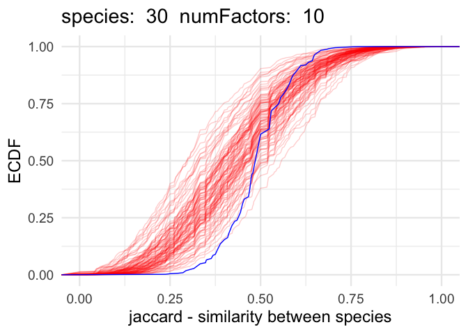<!-- -->

``` r
setwd("~/Desktop/communityDimensions/R/simulation_setup/test_data/correctlySpecifiedResults")
load("r25.RData")
makeJaccardECDF(fit.boral, paste("species: ", scenarios[25,1]," numFactors: ", scenarios[25,2]))
```

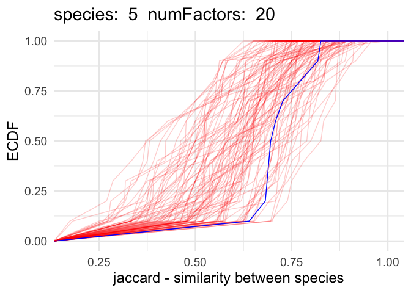<!-- -->

``` r
setwd("~/Desktop/communityDimensions/R/simulation_setup/test_data/correctlySpecifiedResults")
load("r26.RData")
makeJaccardECDF(fit.boral, paste("species: ", scenarios[26,1]," numFactors: ", scenarios[26,2]))
```

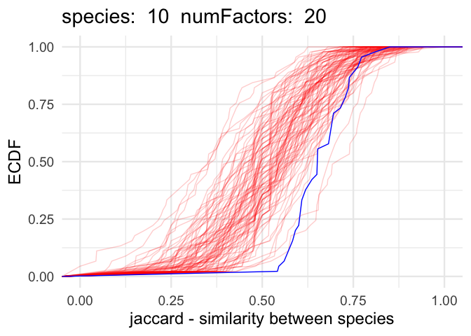<!-- -->

``` r
setwd("~/Desktop/communityDimensions/R/simulation_setup/test_data/correctlySpecifiedResults")
load("r27.RData")
makeJaccardECDF(fit.boral, paste("species: ", scenarios[27,1]," numFactors: ", scenarios[27,2]))
```

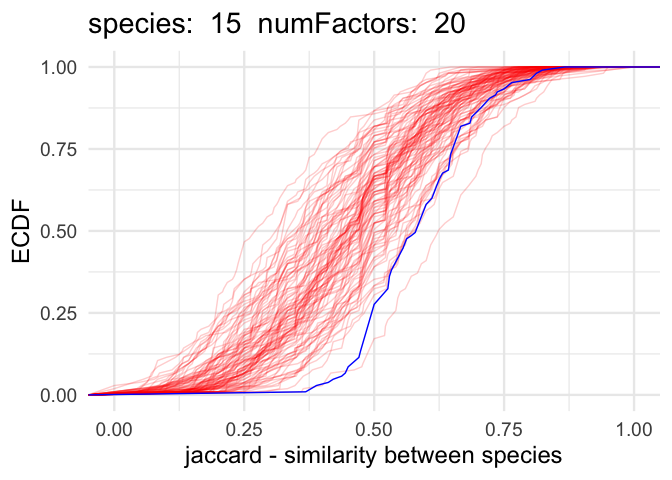<!-- -->

``` r
setwd("~/Desktop/communityDimensions/R/simulation_setup/test_data/correctlySpecifiedResults")
load("r28.RData")
makeJaccardECDF(fit.boral, paste("species: ", scenarios[28,1]," numFactors: ", scenarios[28,2]))
```

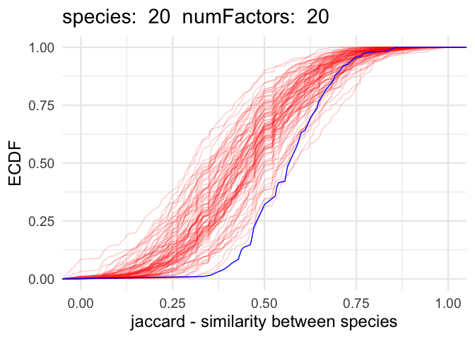<!-- -->

``` r
setwd("~/Desktop/communityDimensions/R/simulation_setup/test_data/correctlySpecifiedResults")
load("r29.RData")
makeJaccardECDF(fit.boral, paste("species: ", scenarios[29,1]," numFactors: ", scenarios[29,2]))
```

<!-- -->

``` r
setwd("~/Desktop/communityDimensions/R/simulation_setup/test_data/correctlySpecifiedResults")
load("r30.RData")
makeJaccardECDF(fit.boral, paste("species: ", scenarios[30,1]," numFactors: ", scenarios[30,2]))
```

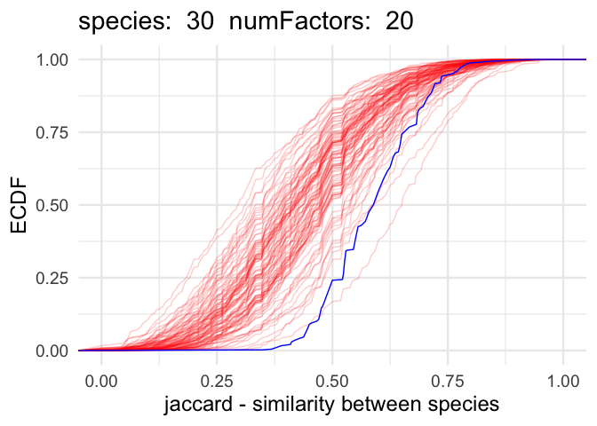<!-- -->

``` r
#https://github.com/cran/jaccard/blob/master/R/jaccard.R
jaccard <- function(x, y, center=FALSE, px=NULL, py=NULL) {
  if(length(x) != length(y)) {
    stop("Two fingerprints (x and y) must be of the same length.")
  }
  
  if(is.null(px) | is.null(py)){
    px <- mean(x)
    py <- mean(y)
  }
  
  sumxy <- sum(x & y)
  unionxy <- sum(x)+sum(y)-sumxy
  if(unionxy == 0) {
    j <- (px*py)/(px+py-px*py)
  } else {
    j <- sumxy/unionxy
  }
  if(center == FALSE) {
    return(j)
  } else {
    return(j - (px*py)/(px+py-px*py))
  }
}


process_jaccardSpecies <- function(fileName, numSpecies){
  #browser()
  load(file=fileName)
  
  truth1 <- fit.boral$yP[nrow(fit.boral$yP), ]
  parsetemp <- unlist(lapply(strsplit(colnames(fit.boral$yStarP), "\\["), function(x) {
    x[2]
  }))
  
  siteNum1 <- unlist(lapply(strsplit(parsetemp, ","), function(x) {
    x[1]
  }))
  speciesNum <- unlist(lapply(strsplit(parsetemp, ","), function(x) {
    x[2]
  }))
  speciesNum1 <- sub("\\]", "", speciesNum)
  
  test <- cbind.data.frame(t(fit.boral$yStarP), speciesNum=speciesNum1, siteNum=siteNum1, truth=truth1)
  
  test2 <- gather(test, -speciesNum, -siteNum, -truth, key = "iteration", value = "val")
  
  trueDist <- subset(test2, iteration == 1)
  trueDist$speciesNum <- as.numeric(as.character(trueDist$speciesNum))
  
  truthNF=matrix(truth1, nrow=numSpecies, ncol=numSpecies, byrow=F)
  
  pairs <- t(combn(1:numSpecies, 2))
  
  obsJ=mapply(function(x,y){jaccard(truthNF[,x], truthNF[,y])},pairs[,1], pairs[,2],SIMPLIFY = F)

  test2$speciesNum=as.numeric(as.character(test2$speciesNum))
  test2$siteNum=as.numeric(as.character(test2$siteNum))
  

  toStore = vector("list", 100)
  idx=1
  for(i in 900:1000){
    
    toUse = subset(test2, iteration==i)
    
    ppcNF <- matrix(nrow=length(unique(test2$siteNum)), ncol=length(unique(test2$speciesNum)))
    ppcNF[cbind(toUse$siteNum, toUse$speciesNum)] <- toUse$val
    
    ppcJ=mapply(function(x,y){jaccard(ppcNF[,x], ppcNF[,y])},pairs[,1], pairs[,2],SIMPLIFY = F) ## want to do this for everything in test2 then collapse
    
    toStore[[idx]] = unlist(ppcJ)
    idx=idx+1
  }
  
 ## take average afterwards not before
  
  ksT = ks.test(unlist(obsJ),  apply(do.call("rbind", toStore),2,mean))
  
  return(ksT$p.value)
}
```

``` r
numSpecies <- c(5, 10, 15, 20, 25, 30)
numFactors <- c(1, 2, 5, 10, 20)

scenarios = expand.grid(numSpecies = numSpecies, numFactors = numFactors)

setwd("~/Desktop/communityDimensions/R/simulation_setup/test_data/correctlySpecifiedResults")

test = mapply(process_jaccardSpecies,list.files()[order(nchar(list.files()))], scenarios$numSpecies,SIMPLIFY = F)

scenarios$pval=unlist(test)
```

``` r
ggplot(scenarios, aes(numSpecies, pval ))+geom_point(cex=2)+geom_line()+facet_wrap(~numFactors, scales = "free_y")+theme_minimal()+ylab("p(ish)-value")
```

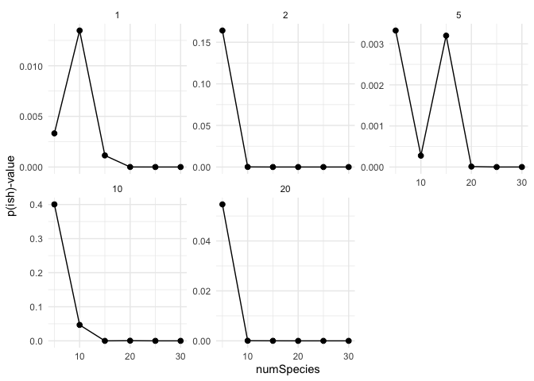<!-- -->
